# lgtv.ps1

A PowerShell controller for LG webOS TVs that establishes one of three
absolute machine states — **Personal**, **Work**, or **Off** — by
synchronising the TV's power, the TV's active HDMI input, and the Windows
desktop topology.

The script assumes nothing about the previous state. Every invocation reads
the TV's own answer, sends commands only when the TV disagrees, and
re-verifies the result before declaring success.

---

## Repository layout

```
LGTV/
    lgtv.ps1                 ← the controller
    wrapper/
        Personal.vbs         ← byte-identical copies
        Work.vbs
        Off.vbs
    README.md
```

The three `.vbs` files are identical byte for byte. Each reads its own
filename to determine which state to request, then launches `lgtv.ps1`
hidden and propagates its exit code. The state name is never written into
the file, so editing one and copying it over the other two is always
safe — there is nothing to keep in sync except the copy operation itself.

---

## The three states

| State      | TV power | TV input      | Windows topology    |
|------------|----------|---------------|---------------------|
| `Personal` | On       | Personal HDMI | Extend (2 monitors) |
| `Work`     | On       | Work HDMI     | Internal only       |
| `Off`      | Off      | *(unchanged)* | Internal only       |

Each state is self-contained. `Off` does not "remember" it followed
`Personal`; `Work` does not assume the TV is already awake. Every
invocation re-establishes the end condition from scratch.

The Windows topology change for `Personal` and `Work` is dispatched to a
background runspace so it overlaps the TV round trips. For `Personal` it
starts *before* the TV is contacted, so the HDMI sink is ready by the time
the input switches. For `Work` it starts *after* the TV sets input, so
Windows cannot hotplug-override the internal-only topology.

---

## How it works

```mermaid
flowchart TD
    Click([Double-click Personal.vbs]) --> Wrapper[wrapper/PERSONAL.vbs]
    Wrapper --> WrapperState[State = filename]
    WrapperState --> WrapperDebug[Read DEBUG_MODE from store]
    WrapperDebug --> WrapperLaunch[wscript.exe Run hidden, wait]
    WrapperLaunch --> Start[lgtv.ps1 STATE]

    Start --> Mutex{Single instance?}
    Mutex -- no --> Exit0([exit 0])
    Mutex -- yes --> Watchdog[Start watchdog]
    Watchdog --> Store[Initialize-Store]
    Store --> Branch{Which state?}

    Branch -- Off --> OffA[Start display topology: Internal]
    OffA --> OffB{TV reachable?}
    OffB -- no --> OffDone[Already off, success]
    OffB -- yes --> OffC[Connect-TV]
    OffC --> OffD[Subscribe power state]
    OffD --> OffE[ssap://system/turnOff]
    OffE --> OffF{Power push or socket close?}
    OffF --> OffDone
    OffDone --> JoinA[Join display topology]
    JoinA --> Done

    Branch -- Personal/Work --> Resolve[Resolve-TVOnline]
    Resolve --> WOL[Send WOL broadcast + unicast]
    WOL --> Probe{TCP 3001 answers?}
    Probe -- no, timeout --> Rescan[Find-TV subnet sweep]
    Rescan --> Probe
    Probe -- yes --> TopoA{Topology Extend?}

    TopoA -- yes --> DispAsync[Start display topology async]
    TopoA -- no --> SkipDisp[Defer display change]
    DispAsync --> Connect
    SkipDisp --> Connect

    Connect[Connect-TV] --> EWS{Daemon says EWS?}
    EWS -- yes --> Retry[Wait 1s, retry up to 30x]
    Retry --> EWS
    EWS -- no --> Ready[WebSocket registered]
    Ready --> SetInput

    subgraph SetInput [Set-TVInput: read, switch, verify]
        direction TB
        WaitReady[Subscribe power state] --> Push1{Ready push?}
        Push1 -- no --> WaitReady
        Push1 -- yes --> SubFG[Subscribe foreground app]
        SubFG --> ReadFG[GET current foreground app]
        ReadFG --> Match{Matches target?}
        Match -- yes --> Settle
        Match -- no --> Launch[ssap://launcher/launch]
        Launch --> AwaitPush{Foreground push arrives?}
        AwaitPush -- timeout --> ReadFG
        AwaitPush -- yes --> ReadFG
        Settle[2s listen-only settle window] --> Held{Input held?}
        Held -- no, TV changed app --> ReadFG
        Held -- yes --> Verified[Input verified]
    end

    Verified --> TopoB{Topology Internal?}
    TopoB -- yes --> DispSync[Start display topology]
    TopoB -- no --> JoinB[Complete display topology]
    DispSync --> JoinB
    JoinB --> Check{All pieces confirmed?}
    Check -- no --> Fail([exit 1])
    Check -- yes --> Done([exit 0])

    Done --> WrapperExit[Wrapper propagates exit code]
    Fail --> WrapperExit
```



Three design principles are visible in the diagram:

- **The wrapper exists for exactly two things.** Suppressing the console
  flash that `powershell.exe -WindowStyle Hidden` does not suppress on its
  own, and propagating the exit code back to whatever launched it. It has
  no other role. All state logic lives in `lgtv.ps1`.
- **Nothing is polled for its own sake.** Every wait — for the TV to come
  up, for the power state to change, for the foreground app to switch, for
  the display topology to reproject — is waiting on a signal the OS or the
  TV emits. Timeouts exist only as outer failure bounds.
- **Independent work runs concurrently.** The display topology change is
  dispatched to a background runspace the moment it is valid to run and
  joined at the end. The two orders (before / after the TV contact) are
  deliberate and tied to the specific timing requirements of each state.

---

## Requirements

- Windows 10 or 11, PowerShell 5.1 or later
- An LG webOS TV on an accesible subnet, reachable by MAC (WOL enabled)
- The TV must have "Mobile TV On" or "Wake on LAN" enabled in its network
  settings, otherwise `Personal` and `Work` will fail at the WOL step

---

## Setup

### 1. Enable wake-on-LAN on the TV

On the TV: **Settings → General → Mobile TV On → Turn on via Wi-Fi** (or
"Turn on via LAN"). The exact menu path varies by model and firmware.

### 2. First run

```powershell
.\lgtv.ps1 Personal
```

Or double-click `wrapper\Personal.vbs`. Either works; the direct script
invocation shows the console output live, which is what you want on the
first run.

The script creates `C:\ProgramData\LGTVControl\lgtv_store.json` on first
invocation and exits with an error telling you to populate two fields. It
will not overwrite the file on subsequent runs — editing `TV_MAC` or
`SUBNET` by hand is safe.

### 3. Populate the store

Open `C:\ProgramData\LGTVControl\lgtv_store.json`:

```json
{
  "_comment": "...",
  "TV_MAC": "AA:BB:CC:DD:EE:FF",
  "SUBNET": "192.168.1.0/24",
  "PERSONAL_INPUT": "com.webos.app.hdmi3",
  "WORK_INPUT": "com.webos.app.hdmi4",
  "DEBUG_MODE": false,
  "tv_ip": "",
  "client_key": ""
}
```

Only `TV_MAC` and `SUBNET` are required. Everything else is filled in
automatically or has a safe default:

- `tv_ip` is discovered by a subnet sweep on first use, then reused. If
  the TV moves to a new DHCP lease, delete it to force a re-scan.
- `client_key` is the webOS pairing key. On the very first successful
  connection the TV will show a pairing prompt on screen — **accept it**.
  The key is encrypted with DPAPI (LocalMachine scope) before being
  stored, so it is readable only by the machine that created it.
- `PERSONAL_INPUT` and `WORK_INPUT` default to `hdmi3` and `hdmi4`. Change
  them if your TV's HDMI ports are numbered differently. The values are
  webOS app IDs, not port numbers — inspect the TV with an existing remote
  app if you need to determine the values.
- `DEBUG_MODE` is the single switch that controls logging verbosity for
  both `lgtv.ps1` and the wrapper. See the Logging section below.

### 4. Verify

```powershell
.\lgtv.ps1 Personal
.\lgtv.ps1 Work
.\lgtv.ps1 Off
```

Each should complete with `State 'X' established in Nms` on the console.
The first `Personal` or `Work` after a cold boot will take 15–30 seconds
while the TV's websocket daemon starts. Subsequent invocations complete in
1–3 seconds.

Then double-click each of `wrapper\Personal.vbs`, `wrapper\Work.vbs`, and
`wrapper\Off.vbs` to confirm the wrapper path works end to end. The first
two should switch the TV input and the Windows topology; the third should
power the TV off.

### 5. Create shortcuts (optional)

If you want desktop icons, hotkey targets, or Stream Deck buttons, create
shortcuts pointing at the `.vbs` files. Shortcut Target:

```
%SystemRoot%\System32\wscript.exe "<full path>\wrapper\Personal.vbs"
```

Note: you cannot rely on the shortcut's *own* name to carry the state —
`.lnk` files do not expose their name to the process they launch, only
their Arguments field. That is why the state lives in the wrapper's
filename, not in a shortcut's name. Three shortcuts, three targets, three
`.vbs` files.

---

## Logging

Three files live in `C:\ProgramData\LGTVControl\`:

- **`lgtv.log`** — the main run log, written by `lgtv.ps1`.
- **`wrapper.log`** — the wrapper's own log. Written only by the wrapper,
  only for its own startup failures and the child's exit code.
- **`lgtv_store.json`** — configuration and cached credentials.

### `DEBUG_MODE`

A single boolean in `lgtv_store.json`, read at startup by **both**
`lgtv.ps1` and the wrapper, so the two processes always agree on the
logging verbosity:

- **`false`** (default) — only failure lines are persisted. Successful
  runs leave no trace on disk. The wrapper logs nothing unless the child
  process failed. This is what you want for day-to-day use.
- **`true`** — every line is persisted. Full trace of both processes for
  debugging.

Console output is always fully verbose regardless of `DEBUG_MODE`; the
flag controls only what reaches disk. Flip it in `lgtv_store.json` and the
change takes effect on the next run of either process.

Both logs rotate to `<name>.old` at 2 MB.

If an editor has opened and saved either log, its ACL may be broken. Both
`lgtv.ps1` and the wrapper repair this automatically: directory
permissions are re-applied at startup, and every write uses a
read-then-overwrite pattern that replaces the file's content without
needing write permission on the pre-existing file's DACL.

---

## Configuration reference

Constants near the top of `lgtv.ps1`:

| Variable               | Default | Meaning                                                                        |
|------------------------|---------|--------------------------------------------------------------------------------|
| `$WatchdogSec`         | `75`    | Force-exit bound for the whole run. Increase if your TV is very slow to boot.  |
| `$MaxRegisterAttempts` | `30`    | EWS retries during a cold boot, spaced 1 s apart.                              |
| `$MaxSwitchPasses`     | `6`     | Read/switch/re-read passes if the TV keeps reverting off the target input.     |
| `$InputSettleMs`       | `2000`  | Listen-only window proving the TV did not overwrite the input during boot.     |
| `$TVOnlineTimeoutMs`   | `25000` | Bound for WOL to bring the port up.                                            |

`$DEBUG_MODE` no longer lives in the script; it is read from the store.
See the Logging section.

Everything else is an outer failure bound. Nothing is used to pace the
happy path.

Constants near the top of the wrapper:

| Constant              | Default | Meaning                                                            |
|-----------------------|---------|--------------------------------------------------------------------|
| `DEFAULT_STATE`       | `Personal` | Fallback if the filename is not one of the three known states. |
| `DEFAULT_DEBUG_MODE`  | `False` | Fallback if the store cannot be read.                              |
| `MAX_LOG_BYTES`       | `2097152` | Wrapper log rotation threshold, matches `lgtv.ps1`.              |

---

## Exit codes

`lgtv.ps1` returns:

| Code | Meaning                                                                  |
|------|--------------------------------------------------------------------------|
| `0`  | The state was established completely, or another instance held the mutex.|
| `1`  | The state failed to establish. The reason is on the console, and in `lgtv.log`. |

The wrapper propagates the child's exit code verbatim. It additionally
returns:

| Code | Meaning                                                    |
|------|------------------------------------------------------------|
| `2`  | Preflight failed — PowerShell or `lgtv.ps1` not found.     |
| `3`  | Failed to launch the child process.                        |

The watchdog inside `lgtv.ps1` force-exits the process if a run exceeds
`$WatchdogSec`. The next invocation releases the abandoned mutex
automatically.

---

## Troubleshooting

**Wrapper double-click does nothing visible**
That's the point — the wrapper launches PowerShell with no console window.
To see what happened, run `lgtv.ps1` directly instead, or check
`wrapper.log` with `DEBUG_MODE = true`.

**"TV did not become reachable on port 3001"**
The TV did not wake. Check that wake-on-LAN is enabled, that the MAC in
`TV_MAC` matches the TV's network adapter (not the Wi-Fi adapter, if the
TV is wired), and that the TV is on the configured `SUBNET`.

**"TV websocket daemon ready after N EWS retries" never appears**
The TV's websocket daemon never came up. Try a manual power cycle of the
TV; if it persists, the TV's firmware may require a different pairing
path.

**"TV never pushed a ready power state"**
The TV's `getPowerState` subscription did not return an `Active` state
within 20 s. Rare on healthy firmware. If it happens consistently, set
`DEBUG_MODE = true` and inspect the pushed states in `lgtv.log`.

**`Personal` sets HDMI but Windows remains on internal only**
The `SetDisplayConfig` call succeeded but Windows did not reproject within
the 5 s confirmation window. On some laptops this is caused by the HDMI
port powering up *after* the topology call. The `Personal` path starts the
topology change concurrently with the TV work specifically to give the
HDMI sink time to appear; if it still fails, increase `$DisplayConfirmMs`.

**Store file says "populate TV_MAC and SUBNET" but I already did**
The file must be valid JSON. A trailing comma or a smart-quote will cause
the parse to fail and the script to report it as unreadable rather than
overwriting it. Validate with:

```powershell
Get-Content lgtv_store.json | ConvertFrom-Json
```

**Wrapper logs `[Default]` instead of `[Personal]` or `[Work]`**
The filename of the `.vbs` you launched is not one of the three recognised
names. Rename it — the wrapper reads the state from its own filename, so
`LGTV Personal.vbs` will fall through to `DEFAULT_STATE` while
`Personal.vbs` will not.

---

## Scheduling

Both entry points are suitable for a scheduled task (SYSTEM or an
interactive user), a hotkey, or a manual run.

For a scheduled task, invoke the wrapper directly:

```
Program:   wscript.exe
Arguments: "C:\...\LGTV\wrapper\Personal.vbs"
```

The wrapper's exit code propagates through `wscript.exe`, so Task
Scheduler will see the real outcome of the state transition — it is not
reported as success merely because the wrapper launched successfully.

`lgtv.ps1` serialises itself via a global named mutex, so two triggers
firing at once are safe — the second waits up to 15 s for the first to
finish, then runs.

Run with **highest privileges** so the ACL repairs on
`C:\ProgramData\LGTVControl\` succeed. The store's ACL is deliberately
permissive (`BUILTIN\Users: Modify`) so that a run under one identity does
not lock out a run under another.
