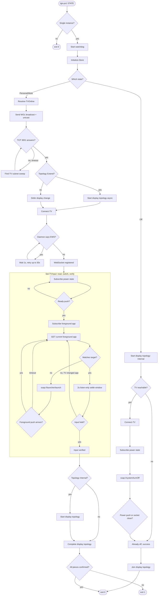

# lgtv.ps1

A PowerShell controller for LG webOS TVs that establishes one of three
absolute machine states — **Personal**, **Work**, or **Off** — by
synchronising the TV's power, the TV's active HDMI input, and the Windows
desktop topology.

The script assumes nothing about the previous state. Every invocation reads
the TV's own answer, sends commands only when the TV disagrees, and
re-verifies the result before declaring success.

---

## The three states

| State      | TV power | TV input      | Windows topology    |
|------------|----------|---------------|---------------------|
| `Personal` | On       | Personal HDMI | Extend (2 monitors) |
| `Work`     | On       | Work HDMI     | Internal only       |
| `Off`      | Off      | *(unchanged)* | Internal only       |

Each state is self-contained. `Off` does not "remember" it followed
`Personal`; `Work` does not assume the TV is already awake. Every
invocation re-establishes the end condition from scratch.

The Windows topology change for `Personal` and `Work` is dispatched to a
background runspace so it overlaps the TV round trips. For `Personal` it
starts *before* the TV is contacted, so the HDMI sink is ready by the time
the input switches. For `Work` it starts *after* the TV sets input, so
Windows cannot hotplug-override the internal-only topology.

---

## How it works



Two design principles are visible in the diagram:

- **Nothing is polled for its own sake.** Every wait — for the TV to come
  up, for the power state to change, for the foreground app to switch, for
  the display topology to reproject — is waiting on a signal the OS or the
  TV emits. Timeouts exist only as outer failure bounds.
- **Independent work runs concurrently.** The display topology change is
  dispatched to a background runspace the moment it is valid to run and
  joined at the end. The two orders (before / after the TV contact) are
  deliberate and tied to the specific timing requirements of each state.

---

## Requirements

- Windows 10 or 11, PowerShell 5.1 or later
- An LG webOS TV on the same subnet, reachable by MAC (WOL enabled)
- The TV must have "Mobile TV On" or "Wake on LAN" enabled in its network
  settings, otherwise `Personal` and `Work` will fail at the WOL step

---

## Setup

### 1. Enable wake-on-LAN on the TV

On the TV: **Settings → General → Mobile TV On → Turn on via Wi-Fi** (or
"Turn on via LAN"). The exact menu path varies by model and firmware.

### 2. First run

```powershell
.\lgtv.ps1 Personal
```

The script creates `C:\ProgramData\LGTVControl\lgtv_store.json` on first
invocation and exits with an error telling you to populate two fields. It
will not overwrite the file on subsequent runs — editing `TV_MAC` or
`SUBNET` by hand is safe.

### 3. Populate the store

Open `C:\ProgramData\LGTVControl\lgtv_store.json`:

```json
{
  "_comment": "...",
  "TV_MAC": "AA:BB:CC:DD:EE:FF",
  "SUBNET": "192.168.1.0/24",
  "PERSONAL_INPUT": "com.webos.app.hdmi3",
  "WORK_INPUT": "com.webos.app.hdmi4",
  "tv_ip": "",
  "client_key": ""
}
```

Only `TV_MAC` and `SUBNET` are required. Everything else is filled in
automatically:

- `tv_ip` is discovered by a subnet sweep on first use, then reused. If
  the TV moves to a new DHCP lease, delete it to force a re-scan.
- `client_key` is the webOS pairing key. On the very first successful
  connection the TV will show a pairing prompt on screen — **accept it**.
  The key is encrypted with DPAPI (LocalMachine scope) before being
  stored, so it is readable only by the machine that created it.
- `PERSONAL_INPUT` and `WORK_INPUT` default to `hdmi3` and `hdmi4`. Change
  them if your TV's HDMI ports are numbered differently. The values are
  webOS app IDs, not port numbers — inspect the TV with an existing remote
  app if you need to determine the values.

### 4. Verify

```powershell
.\lgtv.ps1 Personal
.\lgtv.ps1 Work
.\lgtv.ps1 Off
```

Each should complete with `State 'X' established in Nms` on the console.
The first `Personal` or `Work` after a cold boot will take 15–30 seconds
while the TV's websocket daemon starts. Subsequent invocations complete in
1–3 seconds.

---

## Logging

Two files live in `C:\ProgramData\LGTVControl\`:

- **`lgtv.log`** — the run log. By default only `-IsError` lines are
  persisted, so a successful run leaves no trace. Set `$DEBUG_MODE = $true`
  near the top of the script to persist every line. Rotates to
  `lgtv.log.old` at 2 MB.
- **`lgtv_store.json`** — configuration and cached credentials.

Console output is always fully verbose regardless of `$DEBUG_MODE`; the
flag controls only what reaches disk.

If an editor has opened and saved `lgtv.log`, its ACL may be broken. The
script repairs this automatically: directory permissions are re-applied at
startup, and the log write path uses a temp-file-then-rename pattern that
sidesteps a broken file DACL entirely by creating a fresh file in the
directory the script owns.

---

## Configuration reference

Constants near the top of `lgtv.ps1`:

| Variable               | Default | Meaning                                                                        |
|------------------------|---------|--------------------------------------------------------------------------------|
| `$DEBUG_MODE`          | `$false`| Persist every log line to disk. `$false` = errors only.                        |
| `$WatchdogSec`         | `75`    | Force-exit bound for the whole run. Increase if your TV is very slow to boot.  |
| `$MaxRegisterAttempts` | `30`    | EWS retries during a cold boot, spaced 1 s apart.                              |
| `$MaxSwitchPasses`     | `6`     | Read/switch/re-read passes if the TV keeps reverting off the target input.     |
| `$InputSettleMs`       | `2000`  | Listen-only window proving the TV did not overwrite the input during boot.     |
| `$TVOnlineTimeoutMs`   | `25000` | Bound for WOL to bring the port up.                                            |

Everything else is an outer failure bound. Nothing is used to pace the
happy path.

---

## Exit codes

| Code | Meaning                                                                  |
|------|--------------------------------------------------------------------------|
| `0`  | The state was established completely, or another instance held the mutex.|
| `1`  | The state failed to establish. The reason is on the console, and in `lgtv.log`. |

The watchdog force-exits the process if a run exceeds `$WatchdogSec`. The
next invocation releases the abandoned mutex automatically.

---

## Troubleshooting

**"TV did not become reachable on port 3001"**
The TV did not wake. Check that wake-on-LAN is enabled, that the MAC in
`TV_MAC` matches the TV's network adapter (not the Wi-Fi adapter, if the
TV is wired), and that the TV is on the configured `SUBNET`.

**"TV websocket daemon ready after N EWS retries" never appears**
The TV's websocket daemon never came up. Try a manual power cycle of the
TV; if it persists, the TV's firmware may require a different pairing
path.

**"TV never pushed a ready power state"**
The TV's `getPowerState` subscription did not return an `Active` state
within 20 s. Rare on healthy firmware. If it happens consistently, run
with `$DEBUG_MODE = $true` and inspect the pushed states in `lgtv.log`.

**`Personal` sets HDMI but Windows remains on internal only**
The `SetDisplayConfig` call succeeded but Windows did not reproject within
the 5 s confirmation window. On some laptops this is caused by the HDMI
port powering up *after* the topology call. The `Personal` path starts the
topology change concurrently with the TV work specifically to give the
HDMI sink time to appear; if it still fails, increase `$DisplayConfirmMs`.

**Store file says "populate TV_MAC and SUBNET" but I already did**
The file must be valid JSON. A trailing comma or a smart-quote will cause
the parse to fail and the script to report it as unreadable rather than
overwriting it. Validate with:

```powershell
Get-Content lgtv_store.json | ConvertFrom-Json
```

---

## Scheduling

The script is designed to be triggered from a scheduled task (SYSTEM or an
interactive user), a hotkey, or a manual run. It serialises itself via a
global named mutex, so two triggers firing at once are safe — the second
waits up to 15 s for the first to finish, then runs.

For scheduled tasks, run with **highest privileges** so the ACL repairs on
`C:\ProgramData\LGTVControl\` succeed. The store's ACL is deliberately
permissive (`BUILTIN\Users: Modify`) so that a run under one identity does
not lock out a run under another.
